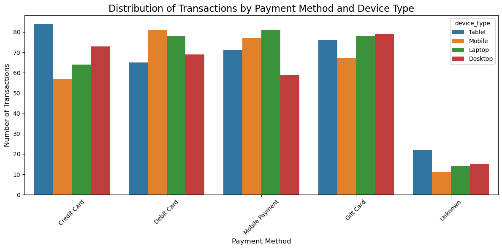
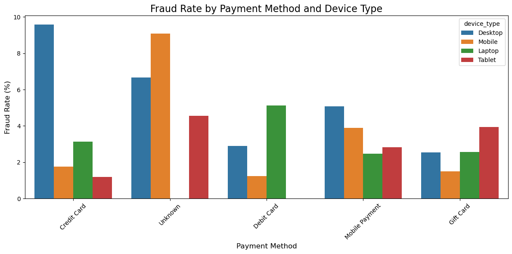
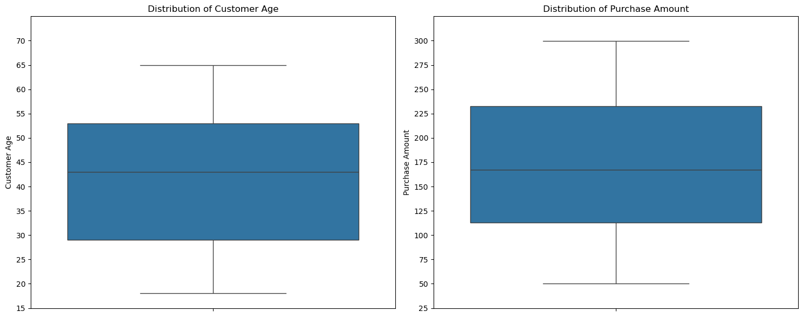
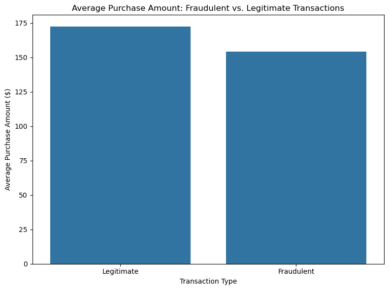
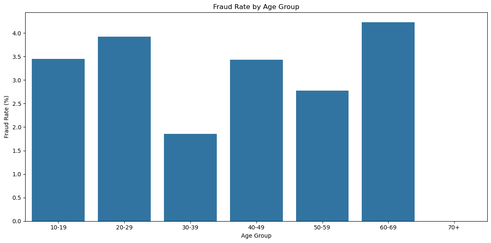
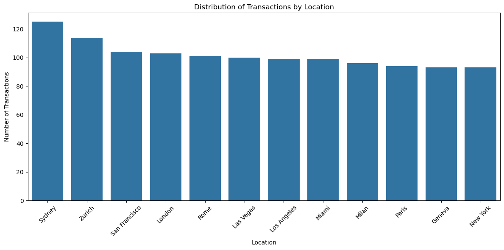
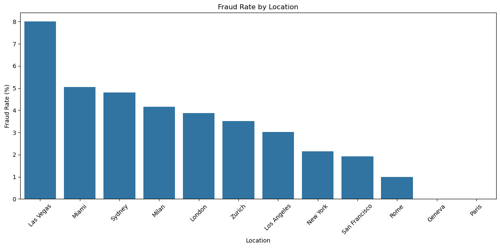
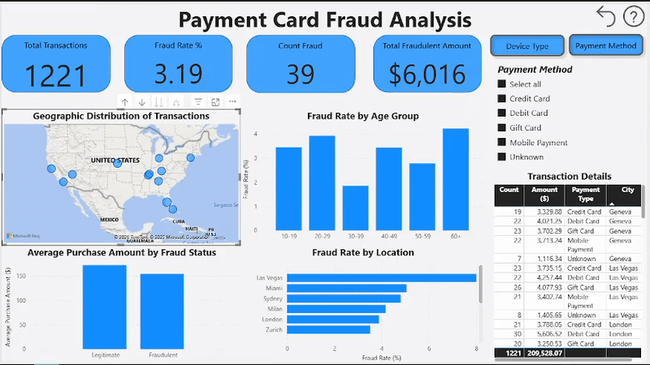

# Project Title
PAYMENT CARD FRAUD DETECTION 2025

---

# Project Description
This project is a complete data lifecycle analysis, focused on fraud detection in luxury cosmetics transactions. Its main purpose is to uncover patterns and characteristics that differentiate fraudulent from legitimate transactions. The project uses a combination of tools to cover all phases of the process: **SQL** for initial data preparation and cleaning, **Python** for exploratory analysis and the identification of key insights, and **Power BI** for the final visualization and communication of the results through an interactive dashboard.

The overall goal is to demonstrate the ability to work with a dataset from start to finish, transforming raw data into valuable information and clear visualizations to support data-driven decision-making. Every stage of the project is oriented toward building a strong portfolio that showcases practical data analysis skills.

---

# The Questions
Below are the questions I want to answer in my project:
1. What is the distribution of payment method types (payment_method) and device types (device_type)?
2. Is there any relationship between the payment method or device type and the fraud rate?
3. How are purchase amounts (purchase_amount) and customer ages (customer_age) distributed?
4. Is there a difference in the average purchase amount between fraudulent and legitimate transactions?
5. Which age groups are most likely to be victims of fraud?
6. How are transactions distributed across different locations?
7. Are there any particular locations with an unusually high fraud rate?

---

# Data Source
Dataset downloaded from Kaggle with the URL:
https://www.kaggle.com/datasets/pratyushpuri/payment-card-fraud-detection-with-ml-models-2025

- Title: Payment Card Fraud Detection 2025
- Author: Pratyush Puri

Many thanks to the author for their dataset that made the development of this project possible.

---

# Accessing and Cleaning Data (SQL/PostgreSQL)
## Tools Used
* **PostgreSQL:** Used for the initial preparation, cleaning, and filtering of the dataset.
* **Visual Studio Code:** My primary development environment for writing and executing SQL queries.

### Data Validation
View my notebook with detailed steps here:
[3-Checking_Dataset.sql](sql/3-Checking_Dataset.sql)
* **Record Count:** Verified the total number of rows imported to ensure a complete dataset load.
* **Fraud Distribution:** Analyzed the distribution of fraudulent transactions to confirm consistency with the dataset metadata.
* **Null Identification:** Identified absent values or those represented as the string 'None' for subsequent cleaning.

### Data Cleaning
View my notebook with detailed steps here:
[4-Cleaning_Dataset.sql](sql/4-Cleaning_Dataset.sql)
* **Handling Nulls:** The text values 'None' in the **payment_method** column were converted to proper **NULL** values for data standardization.
* **Handling Customer Age Nulls:** Records with null values in the **customer_age** column were removed to ensure data integrity for the demographic analysis.

---

# Analysis and Insights (Python)
## Tools Used
* **Python:** Main language for the analysis.
* **Pandas Library:** Used for data manipulation and analysis.
* **Matplotlib and Seaborn Libraries:** Used for creating visualizations and advanced charts.
* **Jupyter Notebooks:** The development environment for running the code, documenting the process, and presenting the analysis results.

# Data Filtering & Assumptions
View my notebook with detailed steps here:
[data_loader.py](notebooks/data_loader.py)

The original 'location' data is inconsistent and lacks a country field.
This code loads a comprehensive list of US cities to filter the dataset.
The project assumes that any transaction matching a city name in this list
is from the United States. This is a necessary assumption for the analysis.

## Exploratory Data Analysis (EDA) Insights
View my notebook with detailed steps here:
[1-EDA.ipynb](notebooks/1-EDA.ipynb)

- Class Imbalance: The dataset shows a significant class imbalance, with a very low proportion of fraudulent transactions compared to legitimate ones. This presents a challenge for building predictive models.

- Payment Methods and Fraud: The fraud rate is notably high for transactions with an 'Unknown' payment method. This suggests that missing data could be a key indicator of fraud.

- Geographic Risk Hotspots: Las Vegas stands out as the location with the highest fraud rate, making it a "hotspot" or high-risk area.

- Age Distribution: The age distribution analysis showed no substantial difference between fraudulent and legitimate transactions, indicating that age is not a primary factor in differentiating fraud.

## The Analysis
### 1. What is the distribution of payment method types and device types?
To analyze the distribution of transactions across different payment methods and device types. This helps to understand which methods and devices are most used by customers, serving as a baseline to identify if specific combinations are more susceptible to fraudulent activities later in the analysis.

View my notebook with detailed steps here:  
[2-payment_device_distribution.ipynb](notebooks/2-payment_device_distribution.ipynb)

#### Visualization:
| Payment Method | Device Type | Transaction Count |
| :--- | :--- | :--- |
| Credit Card | Tablet | 84 |
| Debit Card | Mobile | 81 |
| Mobile Payment | Laptop | 81 |
| Gift Card | Desktop | 79 |
| Debit Card | Laptop | 78 |
| Gift Card | Laptop | 78 |
| Mobile Payment | Mobile | 77 |
| Gift Card | Tablet | 76 |
| Credit Card | Desktop | 73 |
| Mobile Payment | Tablet | 71 |
| Debit Card | Desktop | 69 |
| Gift Card | Mobile | 67 |
| Debit Card | Tablet | 65 |
| Credit Card | Laptop | 64 |
| Mobile Payment | Desktop | 59 |
| Credit Card | Mobile | 57 |
| Unknown | Tablet | 22 |
| Unknown | Desktop | 15 |
| Unknown | Laptop | 14 |
| Unknown | Mobile | 11 |
*This table summarizes the distribution of transactions for each combination of payment method and device type. It provides an overview of the most common usage patterns, serving as a baseline for future investigations into customer behavior and anomaly detection.*

#### Results:

*A bar chart visualizing the distribution of transactions by payment method, broken down by device type.*

#### Insights:
- Dominant Payment Methods: Credit Card and Debit Card are the most frequently used payment methods, indicating they are the primary channels for transactions.

- Device Preference: While Credit Cards are most common, there's no single dominant device across all payment methods. For example, Tablets are the top device for Credit Cards, whereas Laptops are most popular for Mobile Payment transactions.

- Diverse Usage Patterns: The distribution shows significant diversity in user behavior. Instead of a single "winning" combination, transactions are spread across various payment method and device pairings. This suggests that the platform must be optimized to provide a seamless experience for a wide range of users.

- The "Unknown" Anomaly: The Tablet is the most common device for the 'Unknown' payment method. This is an important observation, especially when cross-referenced with the high fraud rate for 'Unknown' transactions.

### 2. Is there any relationship between the payment method or device type and the fraud rate?
This analysis investigates if certain combinations of payment methods and device types are more susceptible to fraud. By calculating the fraud rate for each unique combination, we can identify high-risk pairings and understand which usage patterns require closer monitoring. The findings from this section can inform risk-scoring models and proactive fraud prevention strategies.

View my notebook with detailed steps here:  
[3-fraud_rate_payment_device.ipynb](notebooks/3-fraud_rate_payment_device.ipynb)

#### Visualization:
| Payment Method | Device Type | Total Transactions | Fraud Count | Fraud Rate (%) |
| :--- | :--- | :--- | :--- | :--- |
| Credit Card | Desktop | 73 | 7 | 9.59% |
| Unknown | Mobile | 11 | 1 | 9.09% |
| Unknown | Desktop | 15 | 1 | 6.67% |
| Debit Card | Laptop | 78 | 4 | 5.13% |
| Mobile Payment| Desktop | 59 | 3 | 5.08% |
| Unknown | Tablet | 22 | 1 | 4.55% |
| Gift Card | Tablet | 76 | 3 | 3.95% |
| Mobile Payment| Mobile | 77 | 3 | 3.90% |
| Credit Card | Laptop | 64 | 2 | 3.13% |
| Debit Card | Desktop | 69 | 2 | 2.90% |
| Mobile Payment| Tablet | 71 | 2 | 2.82% |
| Gift Card | Laptop | 78 | 2 | 2.56% |
| Gift Card | Desktop | 79 | 2 | 2.53% |
| Mobile Payment| Laptop | 81 | 2 | 2.47% |
| Credit Card | Mobile | 57 | 1 | 1.75% |
| Gift Card | Mobile | 67 | 1 | 1.49% |
| Debit Card | Mobile | 81 | 1 | 1.23% |
| Credit Card | Tablet | 84 | 1 | 1.19% |
| Debit Card | Tablet | 65 | 0 | 0.00% |
| Unknown | Laptop | 14 | 0 | 0.00% |
*This table summarizes the fraud rates for each combination of payment method and device type. Its purpose is to identify the highest-risk combinations and anomalous patterns, such as Unknown transactions which have a significantly high fraud percentage.*

#### Results:

*A bar chart visualizing the fraud rate by payment method and device type.*

#### Insights:
- Credit Card on Desktop is a Major Fraud Hotspot: The fraud rate is highest for transactions made with Credit Cards on Desktop computers, suggesting this specific combination is a primary target for fraudulent activity.

- High-Risk Unknown Transactions: The Unknown payment method consistently shows high fraud rates across all devices, particularly on mobile. This indicates that transactions lacking a defined payment method are a significant risk factor and should be a priority for investigation.

- Desktop as a General Risk Factor: As a general pattern, Desktop devices show a higher fraud rate compared to other devices for most payment methods. This suggests that the desktop environment may be more vulnerable to certain types of fraud.

- Specific Fraud Patterns: Fraud is not randomly distributed; it is concentrated in very specific high-risk combinations, such as Credit Card on Desktop and Unknown on Mobile. This allows for a more focused and effective fraud prevention strategy, targeting these particular vulnerabilities rather than all transactions equally.

### 3. How are purchase amounts and customer ages distributed?
This analysis explores the distribution of both customer ages and purchase amounts. By visualizing the medians, interquartile ranges, and outliers for each variable, we can understand customer behavior and identify unusual values. The insights from this section help in customer segmentation and are crucial for flagging transactions that deviate from normal purchasing patterns, which can be a key indicator for anomaly detection.

View my notebook with detailed steps here:  
[4-purchase_age_distribution.ipynb](notebooks/4-purchase_age_distribution.ipynb)

#### Results:

*A box plot visualizing the distribution of customer age and purchase amount.*

#### Insights:
Customer Age Distribution:
- The middle 50% of customer ages (the interquartile range) is concentrated between approximately 28 and 53 years old.
- The median customer age is around 43 years.
- The most extreme ages, without being outliers, are near 18 and 65 years old.

Purchase Amount Distribution:
- The middle 50% of purchase amounts falls between $115 and $235.
- The median purchase amount is around $170.
- The most extreme purchase amounts are near $50 and $290.

Key Finding:
Both distributions are quite symmetrical and show no significant outliers. This indicates that there are no transactions with customer ages or purchase amounts that are extremely unusual and stand out from the rest of the data.

### 4. Is there a difference in the average purchase amount between fraudulent and legitimate transactions?
This analysis investigates if there's a difference in the average purchase amount between fraudulent and legitimate transactions. By calculating and comparing the average purchase amount for each group, we can identify whether a transaction's value is a factor in fraud. The insights from this section are crucial for risk models, as a difference in average amount can be an early signal of fraudulent activity.

View my notebook with detailed steps here:
[5-fraud_legit_purchase_amount.ipynb](notebooks/5-fraud_legit_purchase_amount.ipynb)

#### Visualization:
| fraud_flag | average_purchase |
| :--- | :--- |
| Legitimate | 172.176134 |
| Fraudulent | 154.253333 |
*This table shows the difference in the average purchase amount between legitimate and fraudulent transactions. Its purpose is to demonstrate whether the average value of a purchase varies based on the transaction's nature, which can be a factor in fraud detection models.*

#### Results:

#### Insights:
- Difference in Amounts: Your observation is correct. The average amount for fraudulent transactions is slightly lower than for legitimate ones.

- Average Value Analysis: The bar for legitimate transactions shows an average of ~$172, while fraudulent transactions have an average of ~$154. The difference of about $18 is notable.

- Fraud Pattern: This difference in amount can indicate that fraudsters use smaller transactions to "test" cards or avoid raising alarms with unusually large purchases. This tactic allows them to go undetected more easily.

### 5. Which age groups are most likely to be victims of fraud?
This analysis identifies which age groups are most likely to be victims of fraud. By segmenting customers by age and calculating the fraud rate for each group, we can detect the highest-risk demographic segments. The findings from this section are valuable for personalizing fraud prevention strategies, allowing security measures to focus more on the most vulnerable age groups.

View my notebook with detailed steps here:
[6-age_fraud_risk_analysis.ipynb](notebooks/6-age_fraud_risk_analysis.ipynb)

#### Visualization:
| age_group | rate_fraud |
| :--- | :--- |
| 10-19 | 3.448276 |
| 20-29 | 3.921569 |
| 30-39 | 1.851852 |
| 40-49 | 3.435115 |
| 50-59 | 2.777778 |
| 60-69 | 4.225352 |
| 70+ | NaN |
*This table shows the fraud rate for each age group. Its purpose is to highlight which demographic segments are most likely to be victims of fraud, a key insight for tailoring fraud prevention strategies.*

#### Results:

*A bar chart visualizing the fraud rate for each age group.*

#### Insights:
- Highest-Risk Groups: The age group with the highest fraud rate is 60-69 years old (~4.2%), closely followed by 20-29 year olds (~3.9%). This difference suggests that fraud affects different demographics for various reasons.

- Possible Fraud Motives: As you correctly pointed out, fraud among older individuals could be linked to a lack of technical knowledge, while for younger people (10-29), it might be a result of less shopping experience. The 10-19 age group also shows a high rate (~3.4%), reinforcing this hypothesis.

- The Surprising Factor: The high fraud rate in the 40-49 age group (~3.4%) is noteworthy. You'd expect this demographic to have a balance of tech-savviness and purchasing experience. This finding warrants further investigation to understand their specific vulnerabilities.

- Lowest-Risk Segment: The 30-39 age group has the lowest fraud rate of all (~1.8%), which could indicate a period of greater caution and maturity in purchasing behavior.

### 6. How are transactions distributed across different locations?
This analysis explores how transactions are distributed across different locations. By counting and visualizing the number of transactions per city, we can identify key markets with the highest activity. The insights from this section are crucial for understanding business performance and are vital for focusing fraud detection efforts on high-traffic locations.

[7-geographic_transaction_distribution.ipynb](notebooks/7-geographic_transaction_distribution.ipynb)

#### Visualization:
| location | count_transactions |
| :--- | :--- |
| Sydney | 125 |
| Zurich | 114 |
| San Francisco | 104 |
| London | 103 |
| Rome | 101 |
| Las Vegas | 100 |
| Los Angeles | 99 |
| Miami | 99 |
| Milan | 96 |
| Paris | 94 |
| Geneva | 93 |
| New York | 93 |
*This table shows the distribution of transactions across different locations. Its purpose is to highlight which cities have the highest transaction volume, a key insight for understanding market activity and focusing fraud detection efforts on high-traffic areas.*

#### Results:

*A bar chart visualizing the distribution of transactions across different locations.*

#### Insights:
- Identification of Key Markets: As you correctly pointed out, Sydney stands out as the location with the highest number of transactions (~125). This makes it a key market for the business and, therefore, a priority area for focusing fraud detection efforts.

- Relatively Stable Distribution: Your observation is accurate: the distribution appears quite stable across most locations. The majority of cities have a transaction count ranging between ~93 and ~104, suggesting a consistent level of market activity in these areas.

- The Surprising Factor (and the need for more data): The finding regarding New York is a critical insight. Despite being a major global city, it shows the lowest number of transactions (~93). This highlights the importance of contextualizing data with external information, such as population or local spending habits. This kind of anomaly warrants further investigation to understand the underlying reasons.

### 7. Are there any particular locations with an unusually high fraud rate?
This analysis identifies locations with an unusually high fraud rate. By calculating the fraud rate for each city and visualizing the results, we can detect geographical areas that present a significant risk. The findings from this section are crucial for a risk assessment system, as they allow fraud prevention resources to be focused on the most vulnerable areas.

View my notebook with detailed steps here:
[8-geographic_fraud_rate.ipynb](notebooks/8-geographic_fraud_rate.ipynb)

#### Visualization:
| location | rate_fraud |
| :--- | :--- |
| Las Vegas | 8.000000 |
| Miami | 5.050505 |
| Sydney | 4.800000 |
| Milan | 4.166667 |
| London | 3.883495 |
| Zurich | 3.508772 |
| Los Angeles | 3.030303 |
| New York | 2.150538 |
| San Francisco | 1.923077 |
| Rome | 0.990099 |
| Geneva | 0.000000 |
| Paris | 0.000000 |
*This table shows the fraud rate for each location. Its purpose is to identify which cities have an unusually high rate of fraudulent transactions, a key insight for geographical risk assessment and for focusing fraud prevention efforts on high-risk areas.*

#### Results:

*A bar chart visualizing the fraud rate for each location.*
#### Insights:
- Identification of High-Risk Locations: The highest fraud rate is observed in Las Vegas at 8.0%, which is significantly higher than the next highest, Miami, at 5.05%. This suggests that certain cities may be "hotspots" for fraudulent activity, likely due to a combination of factors like high tourism or entertainment-focused economies.

- Low-Risk and Anomalous Cases: The remaining cities show notably lower fraud rates. It is a key finding that New York has a low fraud rate of 2.15%, despite its status as a major global hub. This indicates that transaction volume does not directly correlate with fraud risk and that other factors, such as local security infrastructure or demographics, may be influential. Cities like Geneva and Paris stand out with a 0% fraud rate, suggesting a very low-risk environment.

---

# Data Visualization (Power BI)
## Accessing Data (Python/CSV)
* **Python:** Used for export the data to CSV: fraud_data.CSV.

## 1. Dashboard Objective
The main objective of this dashboard is to analyze and visualize fraud patterns in payment card transactions. It aims to answer key business questions, such as the distribution of fraud by payment method, device type, and geographical location, as well as the identification of the most vulnerable demographic groups and transaction amounts. The purpose is to provide a clear and actionable analysis to help businesses make informed decisions, strengthen their security strategies, and mitigate future financial losses.

## 2. Key Visualizations
This dashboard includes several key visualizations, each designed to answer a specific set of analytical questions.

**KPIs (Key Performance Indicators)**: These visuals summarize the most important metrics, including the total number of transactions, fraud rate, fraud count, and total fraudulent amount. They provide an at-a-glance overview of the data.

**Map Visual (Geographic Distribution of Transactions)**: The map shows the geographic distribution of transactions. This helps identify locations with a high volume of transactions and pinpoint areas with unusually high fraud rates.

**Bar Charts (Fraud Rate by Age Group & Fraud Rate by Location)**: These charts segment the data to reveal fraud distribution across different age groups and locations. They are crucial for identifying the most vulnerable demographics and high-risk geographical areas.

**Purchase Amount Chart (Average Purchase Amount by Fraud Status)**: This visual compares the average purchase amount of fraudulent transactions against legitimate ones, helping to identify a potential financial signature of fraudulent activity.

**Transaction Details Table (Transaction Details)**: This table allows users to drill down and see the specific details of each transaction. It serves as a tool for a deeper, row-level analysis.

## 3. Interactivity and Functionality
This dashboard is designed to be fully interactive, allowing users to explore the data dynamically rather than viewing a static report.

**Filters (Slicers)**: Users can leverage the Device Type and Payment Method filters to segment the data and analyze fraud based on specific criteria.

**Cross-Visual Interactions**: Selecting a data point from any chart or even a city on the map will automatically update all other visuals on the dashboard. This allows for a seamless and intuitive data exploration experience.

**Conditional Message**: A DAX measure was created to display a clear message when no fraudulent transactions are found. This improves the user experience, as they do not see an empty dashboard.

## 4. Data Model & Key Metrics
Data Modeling: The dataset was imported into Power BI, where a structured model was created to establish relationships between different tables (e.g., transactions, customers, and locations). This process optimized the data for performance and analysis.

DAX Measures & Calculated Columns: Core performance indicators and data transformations were built using DAX to provide dynamic and accurate insights. These include:

fraud message: A custom measure that displays a clear message when no fraudulent transactions are found.

analysis_age_group: A calculated column that groups customer ages into specific categories, enabling analysis by age demographic.

analysis_fraud_status: A calculated column that labels transactions as "Fraudulent" or "Legitimate" for easier analysis and visualization.

## Visual Demonstration

---
# What I Learned
This project provided a comprehensive, end-to-end learning experience, covering the entire data analysis workflow. Here are a few specific skills I developed throughout the process:

**Data Preparation & Transformation**: I gained hands-on experience using SQL and Python for initial data cleaning, transformation, and manipulation. This included validating data integrity, handling null values, and performing exploratory data analysis to uncover key insights before visualization.

**DAX & Data Modeling**: I learned to build a structured data model in Power BI, establishing relationships between tables to ensure data integrity and performance. I also developed key metrics and new data columns using DAX, including custom measures to support the dashboard's interactivity.

**Data Visualization & Storytelling**: I learned to design a visually compelling and interactive dashboard. By implementing cross-visual interactions, dynamic messages, and a clean layout, I focused on turning complex data into a clear narrative that provides actionable insights for stakeholders.

# General Insights
 - **Risk Identification**: It was found that the fraud rate varies significantly depending on the payment method, device type, customer age, and location. The highest fraud rate was found in transactions made with a Credit Card on a Desktop device.

- **Most Vulnerable Segments**: Demographic analysis revealed that the 60-69 and 20-29 age groups have the highest fraud rates, while 30-39 year-old buyers are the least prone to fraud.

- **Transaction Patterns**: It was observed that the average purchase amount of fraudulent transactions is slightly lower than that of legitimate transactions, which could be a factor for risk models.

- **Geographic Hotspots**: Geographic analysis identified that the fraud rate does not correlate with transaction volume. Cities like Las Vegas and Miami are fraud hotspots, while others like New York have an unexpectedly low fraud rate.

# Challenges I Faced
This project was not without its challenges, but it provided excellent learning opportunities.

- **Data Quality and Assumptions**: The dataset presented several quality issues, including null values and inconsistent location data. This required me to make key assumptions, like filtering the data to the United States, and to perform thorough cleaning in SQL to ensure the accuracy of the final analysis.

- **Class Imbalance**: The dataset had a significant class imbalance between fraudulent and legitimate transactions. This required careful consideration during the exploratory data analysis and influenced how I chose to present the insights, focusing on fraud rates rather than simple counts.

- **Translating Insights to Visualization**: A key challenge was designing a dashboard that effectively told a story. I learned that simply creating visuals isn't enough; they must be structured to answer specific questions, and the dashboard's interactivity must be intuitive to guide the user through the data.

# Conclusion:
This project demonstrates a complete, end-to-end data analysis workflow, from initial data preparation and cleaning to final visualization. The interactive dashboard provides clear, actionable insights into payment card fraud, identifying high-risk locations, vulnerable demographics, and key transaction patterns. This work not only addresses a critical business problem but also serves as a strong portfolio piece, showcasing the ability to transform raw data into a powerful tool for data-driven decision-making.